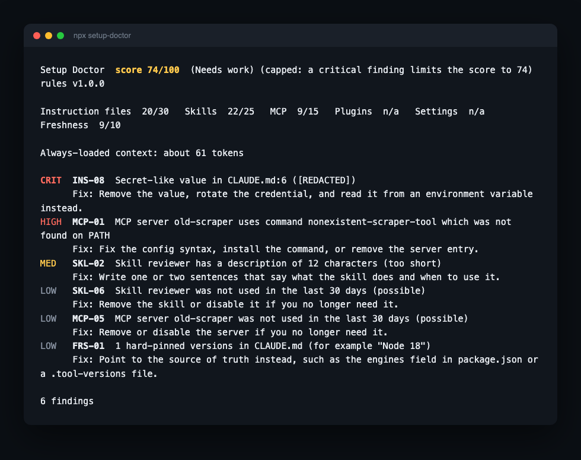

# setup-doctor

Score and improve your AI coding agent setup. Local-only, open source, free.

[](#badge)

That's this repository's own real score, produced by running `setup-doctor` against itself (see [`docs/notes.md`](docs/notes.md) for how). It is not a mockup.

> `setup-doctor` audits how [Claude Code](https://claude.com/claude-code), [GitHub Copilot CLI](https://docs.github.com/en/copilot), Codex or Cursor is configured in your project and globally, gives it a 0-100 score with concrete fixes, and turns your local usage logs into a shareable "Wrapped" card. Everything runs on your machine. Nothing is ever sent anywhere.



This is real `npx setup-doctor` output (against a small demo project, not this repository): a critical secret finding, a dead MCP server command, a thin skill description, and the score capped because of the critical finding. Not a mockup.

## What it does

- **Doctor**: audits instruction files (`CLAUDE.md` / `.github/copilot-instructions.md` / `AGENTS.md` / `.cursorrules`), skills, subagents, MCP servers, plugins, settings and hooks. Runs 29 rules across 6 categories and returns a score, a band (Excellent / Good / Needs work / Poor), and a specific fix for every finding.
- **Wrapped**: summarizes your local session logs (Claude Code, Codex, GitHub Copilot CLI or Cursor) (sessions, active days, tokens, an API-equivalent cost estimate, streaks, busiest hour, a persona label) into a shareable card, in three visual themes and two sizes, with optional PNG export.
- **Badge**: a static or live (shields.io endpoint) README badge showing your current score.
- **HTML report**: a single self-contained, themed report file. No network requests, strict Content-Security-Policy, everything inlined.
- **MCP server mode**: `npx setup-doctor mcp` exposes Doctor and Wrapped as read-only tools over stdio for Claude Desktop and other MCP clients; see [`docs/guide/mcp-server.md`](docs/guide/mcp-server.md).

## Supported agents

| Agent | Doctor | Wrapped |
| --- | --- | --- |
| [Claude Code](https://claude.com/claude-code) | Full (all 29 rules) | Supported |
| [Codex](https://developers.openai.com/codex) | Instructions + MCP rules | Supported |
| [GitHub Copilot CLI](https://docs.github.com/en/copilot) | Instructions, skills, MCP and settings/hooks rules | Supported |
| [Cursor](https://cursor.com) | Instructions + MCP + project skills rules | Supported on Node 22.5+ (reads Cursor's local `state.vscdb` via the built-in `node:sqlite` module; verified against a real Cursor install, see [`docs/notes.md`](docs/notes.md)) |

Subagents, plugins, settings and hooks checks are Claude Code/Copilot-specific; those categories are simply excluded from the score for Codex/Cursor-only setups rather than counted against you. Skills checks (`.claude/skills` for Claude Code/Copilot CLI, project-scope `.cursor/skills` for Cursor) apply to all three; Cursor's own global/personal skills live in a cloud-synced store rather than a fixed local path, so only its project-scope skills are read (see [`docs/notes.md`](docs/notes.md)). Copilot CLI is documented to read several of Claude Code's own files directly (`.claude/skills`, `.claude/settings.json`, and the "portable format" `.mcp.json`); when a project is detected as both agents, a real problem in one of those shared files is scored once, not once per agent, and the report notes which other agent it also affects.

## Install and run

No install needed, run it with `npx`:

```bash
npx setup-doctor                        # audit the current project (terminal report)
npx setup-doctor doctor --format html   # self-contained HTML report
npx setup-doctor doctor --fix --dry-run # preview safe, mechanical fixes (nothing is changed)
npx setup-doctor badge                  # write a README badge
npx setup-doctor wrapped --period 30d   # usage summary + shareable card
npx setup-doctor rules                  # list all 29 rules
npx setup-doctor explain INS-02         # explain what a rule checks and how to fix it
npx setup-doctor mcp                    # start an MCP server (doctor + wrapped as read-only tools)
```

Or install it with Homebrew (macOS/Linux):

```bash
brew install saxenakapil/setup-doctor/setup-doctor
```

From the [`saxenakapil/homebrew-setup-doctor`](https://github.com/saxenakapil/homebrew-setup-doctor) tap: installs the same npm package `npx` would run, tracks new releases automatically (the tap's own CI bumps the formula daily against npm), and every change to the formula is built and tested end to end on real macOS and Linux runners before it merges.

Or install the [Claude Code plugin](https://docs.claude.com/en/docs/claude-code/plugins) from this repository's marketplace, which exposes `/setup-doctor:doctor` and `/setup-doctor:wrapped` as skills that call the same CLI. Cursor users can copy [`skills-cursor/`](skills-cursor/) into their own project's `.cursor/skills/` for the same two skills, adapted for Cursor; see [`docs/guide/cursor-skills.md`](docs/guide/cursor-skills.md).

### Common flags

| Flag | Applies to | What it does |
| --- | --- | --- |
| `--agent claude\|codex\|cursor\|copilot\|all` | doctor, badge, wrapped | Which agent setup to read (default: auto-detect for doctor/badge, `claude` for wrapped) |
| `--scope project\|global\|all` | doctor, badge | Which locations to check |
| `--format` | doctor: `terminal\|json\|html`; wrapped: `terminal\|json` (no `html`) | Output format |
| `--theme playful\|technical\|mix` | doctor --format html, badge, wrapped | Visual theme (default `playful`) |
| `--min-severity low\|medium\|high\|critical` | doctor | Hide findings below this level (score is unaffected) |
| `--ci --fail-under <n>` | doctor | Exit 1 if the score is below `n`, for CI gates |
| `--ci --compare` | doctor | Appends the score to a local `.setupdoctor-history.jsonl` and exits 1 if it dropped since the last `--ci` run; `--compare` alone (no `--ci`) just prints the delta |
| `--period 7d\|30d\|ytd\|all\|YYYY-MM-DD:YYYY-MM-DD` | wrapped | Time window (default `30d`) |
| `--anonymize` / `--show-projects` | wrapped | Hide project names everywhere / show them on the card (default hidden) |
| `--no-cost` | wrapped | Remove cost figures |
| `--trend` | wrapped | Show the change vs the previous period of the same length (sessions, active days, tokens, cost); not available for `--period all` |
| `--tz <IANA zone>` | wrapped | Timezone for date boundaries (default: local) |
| `--out <path>` / `--yes` | doctor, badge, wrapped | Output folder / overwrite existing files without asking |
| `--config <path>` | doctor, badge, rules, wrapped | Configuration file (default: `<path>/.setupdoctorrc`, see [`docs/guide/config.md`](docs/guide/config.md)); its `agent`/`scope`/`theme`/`minSeverity` fields act as real defaults for the equivalent flag |
| `--no-color` | doctor, wrapped | Disable ANSI color (also off for `--ci`, `NO_COLOR`, or non-TTY output) |
| `--fix` / `--dry-run` / `--allow-dirty` | doctor | Propose (and optionally apply) safe, mechanical fixes; see [`docs/guide/fix-mode.md`](docs/guide/fix-mode.md) |

Run `npx setup-doctor --help` for the full list.

## Badge

```md

```

`npx setup-doctor badge` writes `setup-doctor-badge.svg` and prints a snippet like the one above, with your real score. Pass `--endpoint` to also write a shields.io [endpoint JSON](https://shields.io/badges/endpoint-badge) file; see [`docs/examples/badge-workflow.yml`](docs/examples/badge-workflow.yml) for a GitHub Actions workflow that publishes a live badge from your own CI. [`docs/examples/ci-gate-workflow.yml`](docs/examples/ci-gate-workflow.yml) shows using `--ci --fail-under` to block a PR on a low score.

## Privacy

- **No network calls at runtime.** No telemetry, no update checks, no remote fonts or scripts in any output: enforced by an automated check in CI (`scripts/check-no-network.mjs`).
- **Read-only** on your agent configuration and session logs, everywhere except the optional `--fix` mode, which previews a diff, asks for confirmation, and saves a backup before touching anything.
- **Secret-like values are never printed.** Findings report the rule and location only; the value always shows as `[REDACTED]`.
- **The Wrapped card and the badge contain aggregate numbers only**: no prompts, file paths, usernames or repo names. Project names appear only if you pass `--show-projects`, and `--anonymize` hides them everywhere, including the local report.
- **The session log parser reads metadata only** (timestamps, model, token counts, tool names) and drops message text as each line is read; it is never held in memory beyond the current line.
- Local reports (the HTML report, JSON output) can still contain real file paths from your project; a footer in the HTML report reminds you of that before you share it.

## What this will never do

- **Never call out to the network, at any point, for any reason.** Not for telemetry, not for update checks, not to fetch a rule update or a fresher price table. This is enforced by an automated CI check (`scripts/check-no-network.mjs`), not just a policy.
- **Never execute anything it finds.** It never imports `child_process` and never runs a hook, script, or MCP server command. MCP commands are only checked for existence on `PATH`.
- **Never touch your files without `--fix`, and even then, never without a preview, a confirmation, and a backup first.** Every other command is read-only, always.
- **Never require an account, an API key, or a login.** There is nothing to sign up for and nothing to configure before your first run.
- **Never charge for anything.** `setup-doctor` is free and MIT-licensed, and will stay that way; there is no paid tier this project is funneling you toward.
- **Never add a runtime dependency casually.** The budget is 0 to 3, forever, and every one is reviewed on its own merits (see [`docs/notes.md`](docs/notes.md) for the audit trail on `@resvg/resvg-js`, optional and only used for PNG export, and on `@modelcontextprotocol/sdk` plus its required `zod` peer dependency, used only by `mcp` mode and kept out of the main `dist/bin.js` bundle entirely).

## Guide

Every command, with real (not fabricated) output and worked examples:

- [`docs/guide/getting-started.md`](docs/guide/getting-started.md): your first run, reading the score and a finding
- [`docs/guide/doctor.md`](docs/guide/doctor.md): every `doctor` flag, `--format json`'s full shape, exit codes
- [`docs/guide/wrapped.md`](docs/guide/wrapped.md): periods, privacy flags, the card, `--format json`
- [`docs/guide/fix-mode.md`](docs/guide/fix-mode.md): a real `--fix` walkthrough, `--dry-run` vs. applying, backups
- [`docs/guide/ci-integration.md`](docs/guide/ci-integration.md): the example GitHub Actions workflows and the pre-commit hook, explained
- [`docs/guide/agents.md`](docs/guide/agents.md): what each agent reads, and how a shared file is scored once, not twice
- [`docs/guide/config.md`](docs/guide/config.md): `.setupdoctorrc` fully worked, including `ignore` and what it does not do yet
- [`docs/guide/mcp-server.md`](docs/guide/mcp-server.md): using Doctor and Wrapped as read-only MCP tools from Claude Desktop or another MCP client
- [`docs/guide/cursor-skills.md`](docs/guide/cursor-skills.md): using Doctor and Wrapped as Cursor skills
- [`docs/guide/troubleshooting.md`](docs/guide/troubleshooting.md): "nothing to check," a wrong-looking score, and more

## Docs

- [`docs/scope.md`](docs/scope.md): the frozen v1 scope, data model, outputs and build plan
- [`docs/rules.md`](docs/rules.md): every rule, with detection logic, severity and fix text
- [`docs/themes.md`](docs/themes.md): the three visual themes' design tokens and layouts
- [`docs/notes.md`](docs/notes.md): assumptions, deviations from the spec, and decisions made while building (including everything verified against real Claude Code / Copilot / Codex / Cursor installs and documentation)

## Development

```bash
npm install          # first time; commit package-lock.json
npm run typecheck     # tsc --noEmit
npm test              # vitest
npm run check          # typecheck + tests + privacy guard + version sync + em dash guard (run before every commit)
npm run build          # bundles src/bin.ts to dist/bin.js
npm run smoke:publish  # packs the real tarball, installs it into a scratch project, runs the installed bin
```

The repository must stay public: Claude Code's plugin marketplace and Cowork are reported not to sync private repositories.

## License

MIT. See [`LICENSE`](LICENSE). Bundled font licenses (SIL Open Font License 1.1) are in [`src/data/fonts/LICENSES.md`](src/data/fonts/LICENSES.md).
